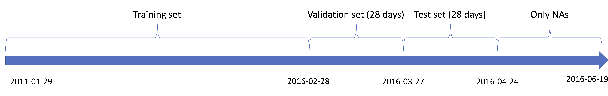

# Introduction

## Contexte and objectives
The objective of this work is, on the basis of a competition organised on Github, the M5 forecasting competition, to make the most accurate possible predictions of sales over 28 days in a Walmart store. 
By analyzing the sales over a period of time from 2011 to 2016, the objective is to find a model, which will make the most accurate predictions possible, based on the knowledge we acquired in the forecasting I course. 

To achieve this goal, we will first familiarize ourselves with the data in the exploratory data analysis part. We will try to understand the different patterns, identify possible trends and seasonalities. 
The data is hierarchical and is divided as follows: there are 10 stores located in 3 different states. We will focus our predictions on the store TX1. Each store is divided into 3 categories, and each of these categories is still composed of different departments. 
We will try several methods to see what gives us the best results. 

first, we will make a hierarchical decomposition of these data (going at most to the 2nd level, the category level). We will considere other stores in the country, using different methods (Bottom-up, Top-down, Middle-out, etc) as well as different techniques (arima, ETS). 
Then, we will try a second approach by analyzing only the store we are interested in, TX1, ignoring the hierarchy. 

Once all these possibilities have been tested, we will select the best model according to certain criteria explained below, and make the predictions for 28 days. 

## Data Division

To evaluate our different models, we have divided our data into 3 parts. Historical data is provided from 2011-01-29 to 2016-06-19, but a part of it contains only NAs. 
We took all the days without NAs, from which we removed 28 days for the validation set and 28 days for the test set. Remaining days are used to train our models. The figure above summarizes our split.  